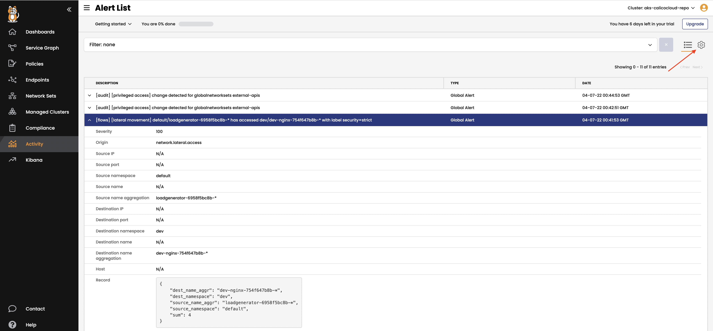
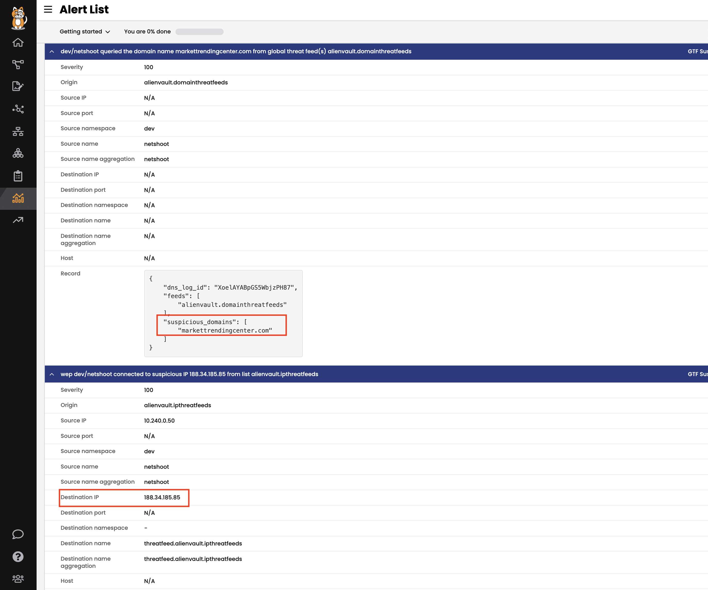

# Module 9: Using alerts

**Goal:** Use global alerts to notify security and operations teams about unsanctioned or suspicious activity.

## Steps

1. Review alerts manifests.

    Navigate to `demo/50-alerts` and review YAML manifests that represent alerts definitions. Each file contains an alert template and alert definition. Alerts templates can be used to quickly create an alert definition in the UI.

2. View triggered alerts.

    >We implemented alerts in one of the first labs in order to see how our activity can trigger them.

    ```bash
    kubectl get globalalert 
    ```

    ```text                        
    NAME                      CREATED AT
    dns.unsanctioned.access   2021-06-10T03:24:41Z
    network.lateral.access    2021-06-10T03:24:43Z
    policy.globalnetworkset   2021-06-10T03:24:41Z
    ```

    Open `Alerts` view to see all triggered alerts in the cluster. Review the generated alerts.

    

    You can also review the alerts configuration and templates by navigating to alerts configuration in the top right corner.
<br>


3. Trigger dns alerts from curl demo.
   
   ```bash
   
   #curl example.com couple times to trigger the dns aler
   kubectl -n dev exec -it netshoot -- sh -c 'curl -m3 -sI www.google.com 2>/dev/null | grep -i http'
   ```
   

4. Trigger GlobalThreatfeed from known bad actors.

 - Calicocloud offers [Global threat feed](https://docs.tigera.io/reference/resources/globalthreatfeed) resource to prevent known bad actors from accessing Kubernetes pods.

    ```bash
    kubectl get globalthreatfeeds
    ```

    >Output is 
    ```bash
    NAME                           CREATED AT
    alienvault.domainthreatfeeds   2021-09-28T15:01:33Z
    alienvault.ipthreatfeeds       2021-09-28T15:01:33Z
    ```

    You can get these domain/ip list from yaml file, the url would be:

    ```bash
    kubectl get globalthreatfeeds alienvault.domainthreatfeeds -ojson | jq -r '.spec.pull.http.url'

    kubectl get globalthreatfeeds alienvault.ipthreatfeeds -ojson | jq -r '.spec.pull.http.url'
    ```

    >Output is 
    ```bash
    https://installer.calicocloud.io/feeds/v1/domains

    https://installer.calicocloud.io/feeds/v1/ips
    ```


 - Generate `Suspicious IPs/Domains` alerts by curl those list above. Use `facebookint.com` and `188.34.185.85` as example:
   
    ```bash
    # generate suspicious DNS alerts
    kubectl -n dev exec -t netshoot -- sh -c "ping -c1 facebookint.com"

    # generate suspicious IP alerts
    kubectl -n dev exec -t netshoot -- sh -c "ping -c3 188.34.185.85"
    ```


 - Open `Alerts` view to see all triggered alerts in the cluster. Review the generated alerts.

    


[Next -> Module 10](../modules/anomaly-detection.md)
